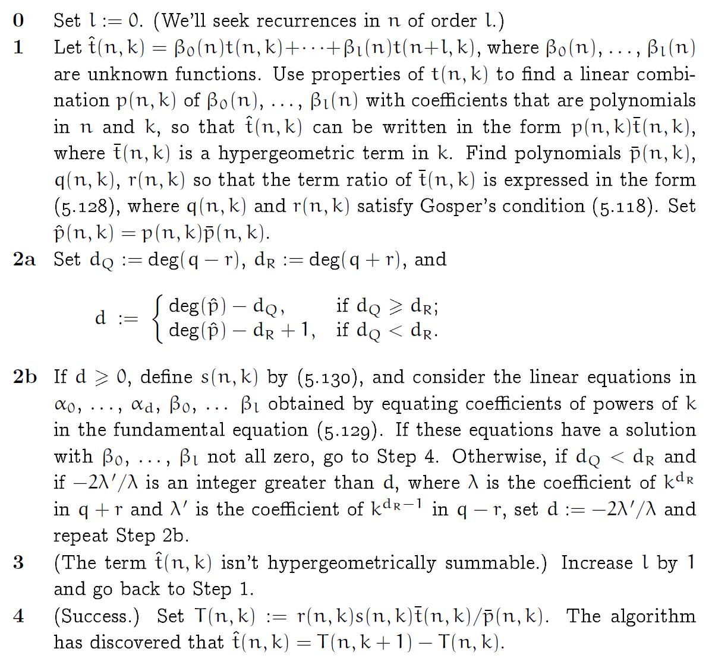

# Concrete Mathematics

---

## 1 Recurrent Problems

There are recurrences that don't have simple closed forms. When such recurrences turn out to be important, because they **arise repeatedly**, we add new operations to our repertoire; this can **greatly extend the range** of problems solvable in "simple" closed form.

---

### 1.1 The Tower of Hanoi

We are given a tower of eight disks, initially stacked in decreasing size on one of three pegs. The objective is to transfer the entire tower to one of the other pegs, moving only one disk at a time and never moving a larger one onto a smaller. Let $T_n$ be the minimum number of moves that will transfer $n$ disks from one peg to another under Lucas's rules. Then

$$
\begin{array}{rcl}
T_0 & = & 0;\\
T_n & = & 2T_{n−1} + 1 , \; \text{for} \; n > 0.
\end{array}
$$

One way is to guess the correct solution by looking at small cases, then to prove that our guess is correct using mathematical induction. The anwser is

$$
T_n = 2^n − 1, \; \text{for} \; n \ge 0.
$$

---

Q1.1 - Assuming that there are n different sizes of disks and exactly $m_k$ disks of size $k$. Determine $A(m_1, \ldots , m_n)$, the minimum number of moves needed to transfer a tower when equal-size disks are considered to be indistinguishable.

Q1.2 - Find the minimum number of moves $F(k, n)$ that will transfer $n$ disks from one peg to another if there are $k$ pegs.

---

### 1.2 Lines in the Plane

How many slices of pizza can a person obtain by making $n$ straight cuts with a pizza knife? After some thought we realize that the $n$th line increases the number of regions by $k$ if and only if it splits $k$ of the old regions. The recurrence is therefore

$$
\begin{array}{rcl}
T_0 & = & 0;\\
T_n & = & T_{n−1} + n, \; \text{for} \; n > 0.
\end{array}
$$

We can use a trick that Gauss reportedly when he was nine years old, which is merely adding the numbers to its reversal. The solution is

$$
T_n = \frac{n(n+1)}{2} + 1, \; \text{for} \; n \ge 0.
$$

---

Q2.1 - What's the maximum number of regions definable by n zig-zag lines, each of which consists of two parallel infinite half-lines joined by a straight segment?

Q2.2 - Find a recurrence relation for $P(n, d)$, the maximum number of $d$-dimensional subspaces that can be defined by $n$ different hyperplanes.

---

### 1.3 The Josephus Problem

We start with n people numbered $1$ to $n$ around a circle, and we eliminate every second remaining person until only one survives. The problem: Determine the survivor's number, $J(n)$. Because J(n) always seems to be odd, we condider the even case and the odd case respectively. The recurrence is

$$
\begin{array}{rcl}
J(1) & = & 1;\\
J(2n) & = & 2J(n) - 1, \; \text{for} \; n \ge 1;\\
J(2n + 1) & = & 2J(n) + 1, \; \text{for} \; n \ge 1.
\end{array}
$$

The solution to the recurrence is

$$
J(2^m + l) = 2l + 1, \; \text{for} \; m \ge 0 \; \text{and} \; 0 \le l < 2^m.
$$

Suppose $n$'s binary expansion is $n = (b_m b_{m−1} \ldots b_1 b_0)_2$, we have

$$
J\left((b_m b_{m−1} \ldots b_1 b_0)_2\right) = (b_{m−1} \ldots b_1 b_0 b_m)_2.
$$

---

If we let $\beta_0 = \beta$ and $\beta_1 = \gamma$, we can rewrite the generalized recurrence

$$
\begin{array}{rcl}
f(1) & = & \alpha;\\
f(2n + j) & = & 2f(n) + \beta_j, \; \text{for} \; j = 0, 1 \; \text{and} \; n \ge 1.
\end{array}
$$

Let $f(n) = A(n)\alpha + B(n)\beta + C(n)\gamma$ and $n = 2^m + l$, where $m \ge 0$ and $0 \le l < 2^m$. Using the **repertoire method**, plugging $f(n) = 1$, $f(n) = n$, $f(n) = n^2$ into $f(0), f(1), f(2)$, we have

$$
\begin{array}{rcl}
A(n) & = & 2^m;\\
B(n) & = & 2^m - 1 - l;\\
C(n) & = & l.
\end{array}
$$

Suppose we now relax the radix $2$ notation to allow arbitrary digits instead of just $0$ and $1$, we have
$$
f\left((b_m b_{m−1} \ldots b_1 b_0)_2\right) = (\alpha \beta_{b_{m−1}} \beta_{b_{m−2}} \ldots \beta_{b_{1}} \beta_{b_{0}})_2.
$$

---

Consider a even more generalized recurrence

$$
\begin{array}{rcll}
f(j) & = & \alpha_j & \text{for} \; 1 \le j < d;\\
f(dn + j) & = & cf(n) + \beta_j,& \text{for} \; 0 \le j < d \; \text{and} \; n \ge 1.
\end{array}
$$

If we start with numbers in radix $d$ and produce values in radix $c$, we have

$$
f\left((b_m b_{m−1} \ldots b_1 b_0)_d\right) = (\alpha_{b_m} \beta_{b_{m−1}} \beta_{b_{m−2}} \ldots \beta_{b_{1}} \beta_{b_{0}})_c.
$$

---

Q3.1 - Suppose there are $2n$ people in a circle; the first $n$ are "good guys" and the last $n$ are "bad guys". Show that there is always an integer $m$ (depending on $n$) such that, if we go around the circle executing every $m$th person, all the bad guys are first to go.

Q3.2 - Suppose that Josephus finds himself in a given position $j$, but he has a chance to name the elimination parameter $q$ such that every $q$th person is executed. Can he always save himself?

Q3.3 - Let's say that a Josephus subset of $\{1, 2, . . . , n\}$ is a set of $k$ numbers such that, for some $q$, the people with the other $n−k$ numbers will be eliminated first. Are non-Josephus subsets rare for large $n$?

---

## 2 Sums

---

### 2.1 Sums and Recurrences

Consider a recurrence of the form

$$
a_nT_n = b_nT_{n−1} + c_n.
$$

Let $s_nb_n = s_{n−1}a_{n−1}$ and $S_n = s_n a_n T_n$. We have a sum-recurrence $S_n = S_{n−1} + s_nc_n = s_1b_1T_0 +
 \sum_{k=1}^n s_k c_k$. Hence the solution is

$$
T_n = \frac{1}{s_n a_n} \left(s_1b_1T_0 + \sum_{k=1}^n s_k c_k \right).
$$

This idea can be used to find the solution of a recurrence that arises in the study of "quick-sort," one of the most important methods for sorting data inside a computer.

---

### 2.2 Manipulation of Sums

There are three simple rules: distributive law, associative law, commutative law. These rules can be used to compute the general sum of an arithmetic progression, $\sum_{k=0}^{n}(a + bk) = (a + \frac{1}{2}b_n)(n + 1)$.

The operation of splitting off a term is the basis of a perturbation method that allow us to find the sum of a general geomeric progression, $\sum_{0\le k\le n} ax^k=a\frac{1-x^{n+1}}{1-x}$ and $\sum_{0\le k\le n} kx^k=x\frac{1 - x^{n+1}-(n+1)x^{n}(1-x)}{(1-x)^2}$, for $x \ne 1$ (more connections between calculus and discrete mathematics).

---

### 2.3 Multiple Sums

For two or more indices, there are a general associative law and a general distributive law. We have an interesting formula:

$$
\left(\sum_{k=1}^n a_k\right) \left(\sum_{k=1}^n b_k\right) = n \sum_{k=1}^n a_k b_k - \sum_{1\le j<k\le n}^n (a_k - a_j)(b_k - b_j),
$$

which yields Chebyshev's monotonic inequalities as a special case.

Here is an example of multiple sums $S_n = \sum_{1 \le j < k \le n} \frac{1}{k-j}$. We can evaluate this sum in two ways, one algebraic and one geometric, which gives us a further identity

$$
S_n = \sum_{0 \le k < n} H_k = n H_n - n.
$$

---

### 2.4 General Methods

There are at least eight methods to solve the the sum of the first $n$ squares

$$
S^{(2)}_n = \sum_{0 \le k \le n} k^2, \; \text{for} \; n \ge 0.
$$

**Method 0**: Look it up.

Handbook of Integer Sequences, Sloane, 1973. Sequence number 1574, and it's called the sequence of "square pyramidal numbers".

**Method 1**: Guess the answer, prove it by induction.

Suppose the equivalent formula is $S^{(2)}_n = \frac{n(n + \frac{1}{2})(n+1)}{3}$. We can prove our conjectures using  Mathematical induction.

---

**Method 2**: Perturb the sum.

Using the perturbation method on $S^{(2)}_n$ reveals a way to sum the first $n$ integers in closed form, $2 \sum_{0 \le k \le n} k = (n+1)^2 - (n+1)$. We can probably get an expression for the integers squared if we start to perturb $S^{(3)}_n = \sum_{0 \le k \le n} k^3$, for $n \ge 0$.

**Method 3**: Build a repertoire.

The solution to $R_0 = \alpha$; $R_n = R_{n−1} + \beta + \gamma n + \delta n^2$, for $n > 0$ will be of the general form $R_n = A(n)\alpha + B(n)\beta + C(n)\gamma + D(n)\delta$. Plugging $f(n) = 1$, $f(n) = n$, $f(n) = n^2$, $f(n) = n^3$ into $f(0), f(1), f(2), f(3)$, we will get the answer.

---

**Method 4**: Replace sums by integrals.

The area under the curve $f(x)=x^2$ is $\int_0^n x^2 dx = \frac{1}{3}n^3$; therefore we know that $S^{(2)}_n$ is approximately $\frac{1}{3}n^3$. 1) One way to use this fact is to examine the error in the approximation $E_n = S^{(2)}_n - \frac{1}{3}n^3$. We find that $E_n = E_{n-1} + n - \frac{1}{3}$. 2) Another way to pursue the integral approach is to find a formula for $E_n$ by summing the areas of the wedge-shaped error terms. Then we get the answer.

---

**Method 5**: Expand and contract. Consider another geometric perspective.

$$
\begin{array}{rcll}
S^{(2)}_n & = & \sum_{1\le k\le n}k^2 = \sum_{1\le j\le k\le n}k\\
& = & \sum_{1\le j\le n} \sum_{1\le k\le n}k\\
& = & \sum_{1\le j\le n} \left(\frac{j+n}{2}\right)(n - j + 1)\\
& = & \frac{1}{2}\sum_{1\le j\le n} \left(n(n+1) + j - j^2\right)\\
& = & \frac{1}{2}n^2(n+1) + \frac{1}{4}n(n+1) - \frac{1}{2}S^{(2)}_n.
\end{array}
$$

**Method 6**: Use finite calculus.

**Method 7**: Use generating functions.

---

**Method 8**: Use telescoping sum. Method of differences.

$$
\begin{array}{rcll}
S^{(2)}_n + S^{(1)}_n & = & \sum_{1\le k\le n}k(k+1)\\
& = & \sum_{1\le k\le n}k(k+1) \cdot \frac{1}{3}\left((k+2) - (k-1)\right)\\
& = & \frac{1}{3} \sum_{1\le k\le n}\left(k(k+1)(k+2) - (k-1)k(k+1)\right)\\
& = & \frac{1}{3} \sum_{1\le k\le n}k(k+1)(k+2) - \frac{1}{3} \sum_{0\le k\le n-1}k(k+1)(k+2)\\
& = & \frac{1}{3} n(n+1)(n+2).
\end{array}
$$

---

### 2.5 Finite and Infinite Calculus

Finite calculus is based on the properties of the difference operator $\Delta$, defined by

$$
\Delta f(x) = f(x + 1) − f(x).
$$

The quantity $x^{\underline{m}}=x(x-1)\cdots(x-m+1)$ is called "x to the m falling"; similarly, $x^{\overline{m}}=x(x+1)\cdots(x+m-1)$ is "x to the m rising". These functions are also called **falling factorial powers** and **rising factorial powers**. Falling powers $x^{\underline{m}}$ are especially nice with respect to $\Delta$. We have

$$
\Delta x^{\underline{m}} = m x^{\underline{m-1}}.
$$

---

$\Delta$ has as an inverse, the anti-difference (or summation) operator $\sum$; and there's another Fundamental Theorem:

$$
g(x) = \Delta f(x) \quad \text{if and only if} \quad \sum g(x) \delta x = f(x) + C.
$$

Finite calculus has definite sums: If $g(x) = \Delta f(x)$, then

$$
\sum_a^b g(x) \delta x = f(x) \bigg|_a^b = f(b) − f(a).
$$

When $a$ and $b$ are integers with $b \ge a$:

$$
\sum_a^b g(x) \delta x = \sum_{k=a}^{b-1} g(x) = \sum_{a \le k < b} g(k).
$$

---

Deffinite summation gives us a simple way to compute sums of falling powers:

$$
\sum_{0 \le k < n} k^{\underline{m}} = \frac{k^{\underline{m+1}}}{m+1} \bigg|_0^{n} = \frac{n^{\underline{m+1}}}{m+1} \; \text{for integers} \; m,n \ge 0.
$$

 A simple calculation shows that $k^3 = k^{\underline{3}} + 3k^{\underline{2}} + k^{\underline{1}}$. Thus

$$
\sum_{a\le k < b}k^3 = \frac{k^{\underline{4}}}{4} + k^{\underline{3}} + \frac{k^{\underline{1}}}{2} \bigg|_a^b.
$$

---

Our general deffinition for negative falling powers is

$$
x^{\underline{-m}} = \frac{1}{(x+1)(x+2)\cdots(x+m-1)}, \; \text{for} \;m>0.
$$

With this definition, we have a falling-power version of the general law of exponents:

$$
x^{\underline{m+n}} = x^{\underline{m}} (x-m)^{\underline{n}}.
$$

We can now give a complete description of the sums of falling powers:

$$
\sum_a^b x^{\underline{m}} \delta x =
\left\{
\begin{array}{ll}
\frac{x^{\underline{m+1}}}{m+1}\bigg|_a^b, & \text{if} \; m \ne -1;\\
H_x \bigg|_a^b, & \text{if} \; m = -1.
\end{array}
\right.
$$

---

The difference of a discrete exponential function $c^x$ is

$$
\Delta (c^x) = (c-1)c^x.
$$

Using the shift operator $Ef(x) = f(x+1)$, we get  a compact rule for the difference of a product:

$$
\Delta(uv) = u \Delta v + Ev \Delta u
$$

Taking the indefinite sum on both sides of this equation, and rearranging its terms, yields the advertised rule for summation by parts:

$$
\sum u\Delta v = uv - \sum Ev \Delta u,
$$

This rule is useful when the sum on the left is harder to evaluate than the one on the right. For example, it can be used to evaluate the sum $\sum_{k=0}^n k 2^k$.

---

### 2.6 Infinite Sums

Any real number $x$ can be written as the difference of its positive and negative parts, $x = x^+ + x^-$, where $x^+ = x \cdot [x > 0]$ and $x^- = -x \cdot [x < 0]$.

Let $A^+ = \sum_{k\in K} a_k^+$ and $A^− = a_k^-$. If $A^+$ and $A^−$ are both finite, the sum $\sum_{k\in K} a_k$ is said to **converge absolutely** to the value $A = A^+ − A^−$.

Each of our transformation rules preserves the value of all absolutely convergent sums.

* The distributive law.
* The associative law.
* The commutative law.
* The fundamental principle of multiple sums: absolutely convergent sums over two or more indices can always be summed first with respect to any one of those indices.

---

## 3 Integer Functions

---

### 3.1 Floors and Ceilings

The floor (greatest integer) and ceiling (least integer) functions:

$$
\lfloor x \rfloor = \text{the greatest integer less than or equal to} \; x;\\
\lceil x \rceil = \text{the greatest integer less than or equal to} \; x.
$$

We have

$$
x − 1 < \lfloor x \rfloor \le x \le \lceil x \rceil < x + 1.
$$

The difference between $x$ and $\lfloor x \rfloor$ is called the fractional part of $x$, and it arises often enough in applications to deserve its own notation:

$$
\{ x \} = x - \lfloor x \rfloor.
$$

---

### 3.2 Floor/Ceiling Applications

The length of $n$ written in binary is $\lceil \log (n+1) \rceil$.

Let $f(x)$ be any continuous, monotonically increasing function with the property that $f(x) = \text{integer} \Longrightarrow x = \text{integer}$. Then we have

$$
\lfloor f(x) \rfloor = \lfloor f(\lfloor x \rfloor) \rfloor \quad \text{and} \quad \lceil f(x) \rceil = \lceil f(\lceil x \rceil) \rceil.
$$

An important special case of this theorem is

$$
\lfloor \frac{x+m}{n} \rfloor = \lfloor \frac{\lfloor x \rfloor+m}{n} \rfloor \quad \text{and} \quad \lceil \frac{x+m}{n} \rceil = \lceil \frac{\lceil x \rceil+m}{n} \rceil.
$$

---

**Level 4 - "must do" problems**: given an explicit set $X$ and an explicit property $P(x)$, find a necessary and sufficient condition $Q(x)$ that $P(x)$ is true.
**Level 5 - "pure research" problems**: given an explicit set $X$, find an interesting property $P(x)$ of its elements.

$$
\,\\
\,\\
$$

**Dare to pose level 5 problems**: this is real mathematics.

---

What is a necessary and sufficient condition that $\lceil \sqrt{\lfloor x \rfloor} \rceil = \lceil \sqrt{x} \rceil$? The answer is when $x = 0$ or $m^2 + 1 \le x \le (m + 1)^2$, we get equality.

How many integers are contained in these intervals? We have the following facts:

$$
\begin{array}{ccc}
\text{interval} & \text{integers contained} & \text{restrictions}\\
[\alpha, \beta] & \lfloor \beta \rfloor - \lceil \alpha \rceil + 1 & \alpha \le \beta,\\
[\alpha, \beta) & \lceil \beta \rceil - \lceil \alpha \rceil & \alpha \le \beta,\\
(\alpha, \beta] & \lfloor \beta \rfloor - \lfloor \alpha \rfloor & \alpha \le \beta,\\
(\alpha, \beta) & \lceil \beta \rceil - \lfloor \alpha \rfloor - 1 & \alpha < \beta.
\end{array}
$$

How many integers $n$, where $1 \le n \le N$, satisfy the relation $\lfloor \sqrt[3]{n} \rfloor \; \backslash \; n$? The answer is

$$
W = \lfloor N/K \rfloor + \frac{1}{2}K^2 + \frac{5}{2}K - 3, \quad K = \lfloor \sqrt[3]{N} \rfloor.
$$

---

We define the spectrum of a real number $\alpha$ to be an inffinite multiset of integers:

$$
\text{Spec}(\alpha) = \{ \lfloor \alpha \rfloor, \lfloor 2\alpha \rfloor, \ldots \}.
$$

The number of elements in $\text{Spec}(\alpha)$ that are $\le n$ is

$$
N(\alpha, n) = \lceil (n+1) / \alpha \rceil.
$$

The positive integers are the disjoint union of $\text{Spec}(\sqrt{2})$ and $\text{Spec}(2+\sqrt{2})$ because of the neat identity $\frac{1}{\sqrt{2}} + \frac{1}{2+\sqrt{2}} = 1$. We say that these spectra form a partition of the positive integers.

---

### 3.3 Floor/Ceiling Recurrences

A more authentic Josephus problem is to eliminate every $q$-th person. The survivor $J_q(n)$ is $qn + 1 − D^{(q)}_k$, where $k$ is as small as possible such that $D^{(q)}_k > (q − 1)n$ and

$$
\begin{array}{l}
D^{(q)}_0 = 1;\\
D^{(q)}_n = \lceil \frac{q}{q-1} D^{(q)}_{n-1} \rceil \quad \text{for} \quad n > 0.
\end{array}
$$

---

### 3.4 'mod': The Binary Operation

We define 'mod' as a binary operation:

$$
x \mod y = x − y \lceil x/y \rceil, \; \text{for} \; y \ne 0.
$$

The partition of $n$ into $m$ as-equal-as-possible parts in nondecreasing order is:

$$
n = \lfloor \frac{n}{m} \rfloor + \lfloor \frac{n+1}{m} \rfloor + \cdots + \lfloor \frac{n + m - 1}{m} \rfloor.
$$

If we replace $n$ by $\lfloor x \rfloor$, we get an identity that holds for all real $x$:

$$
\lfloor mx \rfloor = \lfloor x \rfloor + \lfloor x + \frac{1}{m} \rfloor + \cdots + \lfloor x + \frac{m - 1}{m} \rfloor.
$$

---

### 3.5 Floor/Ceiling Sums

 If $\alpha$ is irrational then the fractional parts $\{n \alpha\}$ are very uniformly distributed between $0$ and $1$, as $n \rightarrow \infty$:

$$
\lim_{n \rightarrow \infty} \frac{1}{n} \sum_{1 \le k < n} f\left(\{ k \alpha \}\right) = \int_0^1 f(x) dx.
$$

We define the discrepancy $D(\alpha, n)$ to be the maximum absolute value, over all $0 \le v \le 1$, of the sum

$$
s(\alpha, n, v) = \sum_{0\le k<n} \left( \left[ \{ k\alpha \} < v \right] - v \right).
$$

$D(\alpha, n)$ is much smaller than $n$, when $n$ is sufficiently large. The idea is that a certain sum $s(\alpha, n, v)$ of $n$ terms can be reduced to a similar sum of at most $\lceil \alpha n \rceil$ terms.

---

We can prove a "reciprocity law" for all real $x$:

$$
\sum_{0 \le k < m} \lfloor \frac{n k + x}{m} \rfloor = d \lfloor \frac{x}{d} \rfloor  + \frac{(m-1)(n-1)}{2} + \frac{d-1}{2} = \sum_{0 \le k < n} \lfloor \frac{m k + x}{n} \rfloor.
$$

---

## 4 Number Theory

---

### 4.1 Divisibility

We say that $m$ divides $n$ (or $n$ is divisible by $m$) if $m$ > 0 and the ratio $n/m$ is an integer:

$$
m \backslash n \iff m > 0 \; \text{and} \; n = mk \; \text{for some integer} \; k.
$$

The **greatest common divisor** of two integers $m$ and $n$ is the largest integer that divides them both:

$$
\gcd(m, n) = \max \{ k | k \backslash m \; \text{and} \; k \backslash n \}.
$$

The **least common multiple** of two integers $m$ and $n$ is

$$
\text{lcm}(m, n) = \min \{ k | k > 0, m \backslash k \; \text{and} \; n \backslash k \}.
$$

---

One of the nicest properties of the gcd is that it is easy to compute, using a 2300-year-old method called Euclid's algorithm（辗转相除）:

$$
\begin{array}{l}
\gcd(0, n) = n ;\\
\gcd(m, n) = \gcd(n \mod m, m), \; \text{for} \; m > 0.
\end{array}
$$

---

### 4.2 Primes

A positive integer $p$ is called **prime** if it has just two divisors, namely $1$ and $p$. The numbers that have three or more divisors are called **composite**.

Any positive integer $n$ can be written as a product of primes, which is called the Fundamental Theorem of Arithmetic:

$$
n = p_1 \cdots p_m = \prod_{k=1}^m p_k, \quad p_1 \le \cdots \le p_m.
$$

---

### 4.3 Prime Examples

Euclid numbers:

$$
e_n = e_1e_2 \cdots e_{n-1} + 1, \; n \ge 1.
$$

Mersenne numbers:

$$
2^p - 1, \; p \; \text{is prime}.
$$

The prime number theorem:

$$
\pi(x) \sim \frac{x}{\ln x},
$$

where $\pi(x)$ denotes the number of primes not exceeding $x$. One simple way to calculate all $\pi(x)$ primes $\le x$ is to form the so-called sieve of Eratosthenes.

---

### 4.4 Factorial Factors

To approximate $n!$ more accurately for large $n$ we can use Stirling's
formula,

$$
n! \sim \sqrt{2\pi n}\left(\frac{n}{e}\right)^n.
$$

For any given prime $p$, we denote the largest power of $p$ that divides $n!$ by $\epsilon_p(n!)$. We have

$$
\epsilon_p(n!) = n - \nu_p(n),
$$

where $\nu_p(n)$ is the number of $1$'s in the $p$-ary representation of $n$.

---

### 4.5 Relative Primality

When $\gcd(m,n) = 1$, the integers $m$ and $n$ have no prime factors in common and we say that they're relatively prime, $m \perp n$.

The Farey series of order $N$, denoted by $\mathcal{F}_N$, is the set of all reduced fractions between $0$ and $1$ whose denominators are $N$ or less, arranged in increasing order. $\mathcal{F}_N$ defines a subtree of the **Stern-Brocot tree**.

We can regard the tree as a number system for representing rational numbers. Let's use the letters $L$ and $R$ to stand for going down to the left or right branch; then a string of $L$'s and $R$'s uniquely identities a number.

---

$e$'s representation has a regular pattern in the Stern-Brocot system:

$$
e = RL^0RLR^2LRL^4RLR^6LRL^8RLR^{10}LRL^{12}RL \ldots.
$$

There's an intimate relationship between Euclid's algorithm and the Stern-Brocot representations of rationals. Given $\alpha = \frac{m}{n}$, we get $\lfloor \frac{m}{n} \rfloor$ $R$'s, then $\lfloor \frac{n}{m \mod n} \rfloor$ $L$'s, then $\lfloor \frac{m \mod n}{n \mod (m \mod n)} \rfloor$ $R$'s, and so on. These numbers $m \mod n$, $n \mod (m \mod n)$ are just the values examined in Euclid's algorithm.

---

### 4.6 'MOD': The Congruence Relation

Modular arithmetic is one of the main tools provided by number theory.

$$
a \equiv b \; (\mod m) \iff a \mod m = b \mod m.
$$

Congruence is an equivalence relation, it satisfies the reflexive law, the symmetric law, and the transitive law. Most of the algebraic operations that we customarily do with equations can also be done with congruences, such as addition, subtraction and multiplication. The operation of division is conspicuously absent.

$$
ad \equiv bd \iff a = b (\mod \frac{m}{\gcd(m, d)}).
$$

Finding $d'$ and $m'$ such that $d'd + m'm = 1$. We call $d'$ the "inverse of $d$ modulo $m$".

---

A special case of the **Chinese Remainder Theorem** is that if $m \perp n$, then

$$
a \equiv b (\mod mn) \iff a \equiv b (\mod m) \; \text{and} \; a \equiv b (\mod n).
$$

Congruences modulo powers of primes are the building blocks for all congruences modulo integers.

$$
a \equiv b (\mod m) \iff a \equiv b (\mod p^{m_p})
$$

for all $p$, if the prime factorization of $m$ is $\prod_p p^{m_p}$.

---

### 4.7 Independent Residues

One of the important applications of congruences is a **residue number system**, in which an integer $x$ is represented as a sequence of residues with respect to moduli that are prime to each other:

$$
\text{Res}(x) = (x \mod m_1, \ldots, x \mod m_r), \; \text{if} \; m_j \perp m_k \; \text{for} \; 1 \le j < k \le r.
$$

---

How to get from a given sequence of residues ($x \mod m_1, \ldots, x \mod m_r$) back to $x \mod m$, where $m=m_1 \cdots m_r$?

* The key idea is to solve the problem in the two cases $(1, 0)$ and $(0, 1)$; for if $(1, 0) = a$ and $(0, 1) = b$, then $(x, y) = (ax + by) \mod m n$.
* The way to find numbers $a$ and $b$ is to using Euclid's algorithm to first find $m_0$ and $n_0$ such that $m'n + mn' = 1$ and taking $a = n'n$ and $b = m'm$.

---

How many solutions are there to the congruence $x^2 \equiv 1 (\mod m)$?

* First consider the case that $m$ is a prime power, $p^k$, where $k > 0$.
* If $p > 2$, there are exactly two solutions, $x \equiv +1$ and $x \equiv -1$.
* If $p = 2$, there are four solutions when $k \ge 3$, namely $x \equiv \plusmn 1$ and $x \equiv 2^{k-1} \plusmn 1$.

---

### 4.8 Additional Applications

If $m \perp n$ and $j \in [0, m)$, the solution of the congruence $kn \equiv j (\mod m)$ is $k = j n' \mod m$, where $m'm + n'n = 1$.

Fermat's Little Theorem.

$$
n^{p-1} \equiv 1 (\mod p), \; \text{if} \; n \perp p.
$$

Wilson's theorem.

$$
(n - 1)! \equiv -1 (\mod n) \iff n \; \text{is prime, if} \; n > 1.
$$

---

### 4.9 Phi and Mu

The $\phi$ function is called Euler's totient function, which means the number of integers $\{0, 1, \ldots, m-1\}$ that are relatively prime to $m$.

Fermat's theorem can be generalized to nonprime moduli:

$$
n^{\phi(m)} \equiv 1, \; \text{if} \; n \perp m.
$$

* If $m$ is a prime power $p^k$, $\phi(p^k) = p^k - p^{k-1}$.
* If $m > 1$ is not a prime power, $\phi(m) = \phi(m_1) \phi(m_2)$, where $m = m_1m_2$ and $m_1 \perp m2$.

The value of Euler's totient function for general $m$:

$$
\phi(m) = \prod_{p \backslash m} (p^{m_p} - p^{m_p-1}) = m \prod_{p \backslash m} \left(1 - \frac{1}{p}\right).
$$

---

The M$\"o$bius function $\mu(m)$ can be defined for all integers $m \ge 1$ by the equation

$$
\sum_{d \backslash m} \mu(d) = \left[ m = 1\right].
$$

Inversion principle.

$$
g(m) = \sum_{d \backslash m} f(d) \iff f(m) = \sum_{d \backslash m} \mu(d) g(\frac{m}{d}).
$$

We have the general formula

$$
\mu(m) = \prod_{p \backslash m} \mu(p^{m_p}) = \left\{ \begin{array}{ll}
(-1)^{r}, & \text{if} \; m = p_1 p_2 \cdots p_r;\\
0, & \text{if} \; m \; \text{is divisible by some} \; p^2.
\end{array} \right.
$$

---

Let $\Phi(x) = \sum_{1 \le k \le x} \phi(k)$ be number of reduced fractions in $[0, 1]$ whose denominators do not exceed $n$, we have $\sum_{d \ge 1}\Phi(\frac{x}{d}) = \frac{1}{2} \lfloor x \rfloor \lfloor x + 1\rfloor$. By using another property of the M$\"o$bius function, we have

$$
\Phi(x) = \frac{1}{2}\sum_{d \ge 1} \mu(d) \lfloor \frac{x}{d} \rfloor \lfloor \frac{x}{d} + 1\rfloor.
$$

---

## 5 Binomial Coefficients

$\big(\begin{smallmatrix}n\\k\end{smallmatrix}\big)$ can be read "$n$ choose $k$".

---

### 5.1 Basic Identities

Eq. 1 - Factorial expansion.

$$
\begin{pmatrix}n\\k\end{pmatrix} = \left\{ \begin{array}{ll}
\frac{n(n-1)\cdots(n-k+1)}{k(k-1)\cdots 1} = \frac{n^{\underline{k}}}{k!} = \frac{n!}{k!(n-k)!}, & n \ge k \ge 0;\\
0, & k < 0 \; \text{or} \; k > n.
\end{array} \right.
$$

Eq.2 - Symmetry.

$$
\begin{pmatrix}n\\k\end{pmatrix} = \begin{pmatrix}n\\n - k\end{pmatrix}.
$$

Eq. 3 - Absorption.

$$
k \begin{pmatrix}r\\k\end{pmatrix} = r \begin{pmatrix}r - 1\\k - 1\end{pmatrix}.
$$

---

Eq. 4 - Addition. What is the interpretation?

$$
\begin{pmatrix}r\\k\end{pmatrix} = \begin{pmatrix}r - 1\\k\end{pmatrix} + \begin{pmatrix}r - 1\\k - 1\end{pmatrix}.
$$

Eq. 5 - Upper negation.

$$
\begin{pmatrix}r\\k\end{pmatrix} = (-1)^k \begin{pmatrix}k - r - 1\\k\end{pmatrix}.
$$

---

Eq. 6 - Multinomial Theorem & multinomial revision.

$$
\begin{array}{rcl}
 & & (x_1 + x_2 + \cdots + x_m)^n\\
 & = & \sum_{\substack{a_1 \le a_2 \le \cdots \le a_m \\ a_1 + a_2 + \cdots + a_m = n}}x_1^{a_1}x_2^{a_2}\cdots x_m^{a_m}\cdot\begin{pmatrix}a_1+a_2+\cdots+a_m\\a_1,a_2,\ldots,a_m\end{pmatrix}\\
 & = & \sum_{\substack{a_1 \le a_2 \le \cdots \le a_m \\ a_1 + a_2 + \cdots + a_m = n}}x_1^{a_1}x_2^{a_2}\cdots x_m^{a_m}\cdot\frac{(a_1 + a_2 + \cdots + a_m)!}{a_1!a_2!\cdots a_m!}\\
 & = & \sum_{\substack{a_1 \le a_2 \le \cdots \le a_m \\ a_1 + a_2 + \cdots + a_m = n}}x_1^{a_1}x_2^{a_2}\cdots x_m^{a_m}\cdot\begin{pmatrix}a_1+a_2+\cdots+a_m\\a_2+\cdots+a_m\end{pmatrix}\cdots \begin{pmatrix}a_{m-1}+a_m\\a_m\end{pmatrix}.
\end{array}
$$

---

Eq. 7 - Binomial Theorem.

$$
(x+y)^r = \sum_{k} \begin{pmatrix}r\\k\end{pmatrix}x^r y^{r-k}.
$$

 We can do columns, but there is no closed form for the partial sum of a row of Pascal's triangle (except the entries have been given alternating signs or been multiplied by their distance from the center). The relation between these partial sums is analogous to the relation between the integrals (why?)

$$
\int^\alpha_{-\infty} x e^{-x^2} dx = -\frac{1}{2} e^{-\alpha^2} \; \text{and} \; \int^\alpha_{-\infty} e^{-x^2} dx.
$$

A curious relationship.

$$
\sum_{k \le m} \begin{pmatrix}m+r\\k\end{pmatrix}x^r y^{m-k} = \sum_{k \le m} \begin{pmatrix}-r\\k\end{pmatrix}(-x)^k (x+y)^{m-k}.
$$

---

Eq. 8 - Parallel summation. What is the interpretation?

$$
\sum_{k \le n} \begin{pmatrix}r+k\\k\end{pmatrix} = \begin{pmatrix}r+n+1\\n\end{pmatrix}.
$$

Eq. 9 - Upper summation. What is the interpretation?

$$
\sum_{0 \le k \le n} \begin{pmatrix}k\\m\end{pmatrix} = \begin{pmatrix}n+1\\m+1\end{pmatrix}.
$$

---

Eq. 10 - Chu-Vandermonde formula. What is the interpretation? 四元玉鉴·果垛叠藏.

$$
\sum_k \begin{pmatrix}r\\m+k\end{pmatrix} \begin{pmatrix}s\\n-k\end{pmatrix} = \begin{pmatrix}r+s\\m+n\end{pmatrix}.
$$

The hairiest sum of binomial coefficients.

$$
\sum_{k_{ij}} (-1)^{\sum_{i<j}k_{ij}} \prod_{1 \le i < j < n} \begin{pmatrix}a_i+a_j\\a_j + k_{ij}\end{pmatrix} \prod_{1 \le j < n} \begin{pmatrix}a_j + a_n\\a_n + \sum_{i<j}k_{ij} - \sum_{i>j}k_{ij}\end{pmatrix} = \begin{pmatrix}a_1+\cdots+a_n\\a_1,\ldots,a_n\end{pmatrix}.
$$

---

### 5.2 Basic Practice

---

Problem 1: A sum of ratios. Multinomial revision.

$$
\sum_{k=0}^m \frac{\begin{pmatrix}m\\k\end{pmatrix}}{\begin{pmatrix}n\\k\end{pmatrix}} = \frac{n+1}{n+1-m}, \; n \ge m \ge 0.
$$

---

Problem 2: From the literature of sorting. Absorption identity.

$$
T = \sum_{k=0}^n k\frac{\begin{pmatrix}m-k-1\\m-n-1\end{pmatrix}}{\begin{pmatrix}m\\n\end{pmatrix}} = \frac{n}{m-n+1}, \; m > n \ge 0.
$$

---

Problem 3: From an old exam. Recurrence, periodic.

$$
R_n = \sum_{k \le n} \begin{pmatrix}n - k\\k\end{pmatrix}(-1)^k = \left\{ \begin{array}{ll}
R_1 = 1, & \text{if} \; n - 1;\\
R_2 = 0, & \text{if} \; n \; \text{is odd};\\
R_4 = -1, & \text{if} \; n > 0 \; \text{is even}.
\end{array} \right..
$$

---

Problem 4: A sum involving two binomial coefficients. Handled in the general form.

$$
\sum_{k=0}^n \begin{pmatrix}k\\1\end{pmatrix} \begin{pmatrix}m - k - 1\\m - n - 1\end{pmatrix} = \begin{pmatrix}m\\m - n + 1\end{pmatrix}.
$$

---

Problem 5: A sum with three factors. Absorption identity.

$$
\sum_{k} \begin{pmatrix}n\\k\end{pmatrix} \begin{pmatrix}s\\k\end{pmatrix} k = s\begin{pmatrix}n+s-1\\n-1\end{pmatrix}.
$$

---

Problem 6: A sum with menacing characteristics. Remove $k$.

$$
\sum_{k \ge 0} \begin{pmatrix}n+k\\2k\end{pmatrix} \begin{pmatrix}2k\\k\end{pmatrix} \frac{(-1)^k}{k+1} = 0.
$$

---

Problem 7: A new obstacle.

$$
\sum_{k \ge 0} \begin{pmatrix}n+k\\m+2k\end{pmatrix} \begin{pmatrix}2k\\k\end{pmatrix} \frac{(-1)^k}{k+1}.
$$

---

Problem 8: A different obstacle.

$$
\sum_{k \ge 0} \begin{pmatrix}n+k\\2k\end{pmatrix} \begin{pmatrix}2k\\k\end{pmatrix} \frac{(-1)^k}{k+1+m} = (-1)^n m^{\underline{n}}m^{\underline{-n-1}}.
$$

---

### 5.3 Tricks of the Trade

---

Trick 1: Going halves.

$$
\begin{pmatrix}-1/2\\n\end{pmatrix}=\left(\frac{-1}{4}\right)^n\begin{pmatrix}2n\\n\end{pmatrix}.
$$

Trick 2: High-order differences. Newton series.

$$
f(x) = \Delta^df(0)\begin{pmatrix}x\\d\end{pmatrix} + \Delta^{d-1}f(0)\begin{pmatrix}x\\d-1\end{pmatrix} + \cdots + f(0)\begin{pmatrix}x\\0\end{pmatrix}.
$$

Trick 3: Inversion. Rather like the M$\"{o}$bius inversion formulas.

---

### 5.4 Generating Functions

---

An inffinite sequence $<a_0, a_1, a_2, \ldots>$ can be represented as a power series in an auxiliary variable $z$,

$$
A(z) = \sum_{z \ge 0}a_k z^k.
$$

The binomial theorem.

$$
(1+z)^r = \sum_{k \ge 0} \begin{pmatrix}r\\k\end{pmatrix} z^k.
$$

---

Let $A(z)$ be the generating function for $<a_0, a_1, a_2, \ldots>$, and let $B(z)$ be the generating function for another sequence $<b_0, b_1, b_2, \ldots>$. Then $A(z)B(z)$ is the generating function for the sums $<c_0, c_1, c_2, \ldots>$ where $c_n = \sum_{k=0}^n a_k b_{n-k}$.

If $A(z)$ is the generating function for the summands $<a_0, a_1, a_2, \ldots>$, then $A(z)/(1 - z)$ is the generating function for the sums $<c_0, c_1, c_2, \ldots>$ where $c_n = \sum_{k=0}^n a_k$.

---

The generalized binomial series:

$$
\mathcal{B}_t(z) = \sum_{k \ge 0}(tk)^{\underline{k-1}}\frac{z^k}{k!}.
$$

A relation that shows further connections between the functions $\mathcal{B}_{-1}(z)$ and $\mathcal{B}_{2}(z)$:

$$
\begin{array}{rcl}
\frac{\mathcal{B}_{-1}(z)^{n+1}-(-z)^{n+1}\mathcal{B}_2(-z)^{n+1}}{\sqrt{1+4z}} & = & \sum_{k
\le n} \begin{pmatrix}n-k\\k\end{pmatrix} z^k.\\
\end{array}
$$

---

$$
\begin{array}{rcl}
\mathcal{B}_2(z) & = & \sum_k \begin{pmatrix}2k+1\\k\end{pmatrix} \frac{1}{1+2k}z^k = \frac{1-\sqrt{1-4z}}{2z}.\\
\mathcal{B}_2(z)^r & = & \sum_k \begin{pmatrix}2k+r\\k\end{pmatrix} \frac{1}{r+2k}z^k.\\
\frac{\mathcal{B}_2(z)^r}{\sqrt{1-4z}} & = & \sum_k \begin{pmatrix}2k+r\\k\end{pmatrix} z^k.\\
\mathcal{B}_{-1}(z) & = & \sum_k \begin{pmatrix}1-k\\k\end{pmatrix} \frac{1}{1-k}z^k = \frac{1+\sqrt{1+4z}}{2z}.\\
\mathcal{B}_{-1}(z)^r & = & \sum_k \begin{pmatrix}r-k\\k\end{pmatrix} \frac{r}{r-k}z^k.\\
\frac{\mathcal{B}_{-1}(z)^r}{\sqrt{1+4z}} & = & \sum_k \begin{pmatrix}r-k\\k\end{pmatrix} z^k.\\
\end{array}
$$

---

The generalized exponential series:

$$
\mathcal{E}_t(z) = \sum_{k \ge 0}(tk+1)^{k-1}\frac{z^k}{k!}.
$$

The coefficients $(\begin{smallmatrix}2n\\n\end{smallmatrix})\frac{1}{n+1}$ of $B_2(z)=\frac{1-\sqrt{1-4z}}{2z}$ are called the Catalan numbers $C_n$.

---

### 5.5 Hypergeometric Functions

---

The general hypergeometric series is a power series in $z$ with $m + n$
parameters.

$$
F\left(\begin{matrix}a_1,\ldots,a_m\\b_1,\ldots,b_n\end{matrix}\middle|z\right) = \sum_{k \ge 0} \frac{a_1^{\overline{k}} \cdots a_m^{\overline{k}}}{b_1^{\overline{k}} \cdots b_n^{\overline{k}}} \frac{z^k}{k!}.
$$

---

Many important functions occur as special cases of the general hypergeometric.

$$
F\left(\begin{matrix}a\\b\end{matrix}\middle|z\right) = M(a,b,z),\\
F\left(\begin{matrix}a,1\\1\end{matrix}\middle|z\right) = \frac{1}{(1-z)^a},\\
F\left(\begin{matrix}1\\b,1\end{matrix}\middle|z\right) = I_{b-1}(2\sqrt{z})\frac{(b-1)!}{z^{(b-1)/2}},\\
$$

where $M$ is called a "confluent hypergeometric series", $I_{b-1}$ is called a "modified Bessel function" of order $b - 1$.

---

The Gaussian hypergeometric:

$$
F\left(\begin{matrix}a,b\\c\end{matrix}\middle|z\right) = \sum_{k \ge 0} \frac{a^{\overline{k}} b^{\overline{k}}}{c^{\overline{k}}} \frac{z^k}{k!}.
$$

Gauss's hypergeometric series can be written in the recursively factored form

$$
F\left(\begin{matrix}a,b\\c\end{matrix}\middle|z\right) = 1 + \frac{a}{1} \frac{b}{c} z\left(1 + \frac{a+1}{2}\frac{b+1}{c+1}z \left(1+\frac{a+2}{3}\frac{b+2}{c+2}z(1+\cdots) \right) \right).
$$

---

A general identity of Vandermonde's convolution.

$$
F\left(\begin{matrix}a,b\\c\end{matrix}\middle|1\right) = \frac{\Gamma(c-a-b)\Gamma(c)}{\Gamma(c-a)\Gamma(c-b)},
$$

where integer $b \le 0$ or $\mathcal{R}c>\mathcal{R}a+\mathcal{R}b$.

Dixon's formula.

$$
F\left(\begin{matrix}a,b,c\\1+c-a,1+c-b\end{matrix}\middle|1\right) = \frac{(c/2)!}{c!}\frac{(c-a)^{\underline{c/2}}(c-b)^{\underline{c/2}}}{(c-a-b)^{\underline{c/2}}},
$$

where integer $c \le 0$ or $\mathcal{R}c/2 + 1>\mathcal{R}a+\mathcal{R}b$.

---

### 5.6 Hypergeometric Transformations

---

Pfaff's reflection law:

$$
\frac{1}{(1-z)^a} F\left(\begin{matrix}a,b\\c\end{matrix}\middle|\frac{-z}{1-z}\right) = F\left(\begin{matrix}a,c-b\\c\end{matrix}\middle|z\right).
$$

---

The general hypergeometric function $F\left(\begin{matrix}a_1,\ldots,a_m\\b_1,\ldots,b_n\end{matrix}\middle|z\right)$ satisfies the differential equation

$$
D(\vartheta+b_1-1) \ldots D(\vartheta+b_n-1)F = (\vartheta+a_1) \ldots (\vartheta+a_m)F,
$$

where $D$ is the operator $\frac{d}{dz}$, $\vartheta$ is the operator $z\frac{d}{dz}$.

---

### 5.7 Partial Hypergeometric Sums

---

Gosper discovered a beautiful way to find indefinite sums $\sum t(k) \delta k$ whenever $t$ belong to hypergeometric terms.

* Step 1: express the term ratio in the special form $\frac{t(k+1)}{t(k)} =\frac{p(k+1)}{p(k)}\frac{q(k)}{r(k+1)}$, where $p$, $q$, and $r$ are polynomials subject to the following condition: $(k + \alpha) \backslash q(k)$ and $(k + \beta) \backslash r(k) \Longrightarrow \alpha - \beta$ is not a positive integer.
* Step 2: find a hypergeometric term $T(k)$ such that $t(k) = T(k+1) - T(k)$, where $T(k) = \frac{r(k)s(k)t(k)}{p(k)}$. If we can find a polynomial $s(k)$ satisfying $p(k) = q(k)s(k + 1) - r(k)s(k)$ we've found $\sum t(k) \delta k$; otherwise, there's no $T$.

---

Marko Petkov$\v{s}$ek has found a nice way to generalize Gosper's algorithm to more complicated inversion problems, by showing how to determine all hypergeometric terms $T(k)$ that satisfy the $l$th-order recurrence

$$
t(k) = p_l(k)T(k+l) + \cdots + p_0(k)T(k).
$$

---

### 5.8 Mechanical Summation

---

The Gosper-Zeilberger algorithm.

---

The Gosper-Zeilberger algorithm is guaranteed to succeed in an enormous number of cases, namely whenever the summand $t(n, k)$ is a so-called **proper term** - a term that can be written in the form

$$
t(n,k)=f(n,k)\frac{(a_1n+a_1'k+a_1'')!\ldots(a_pn+a_p'k+a_p'')!}{(b_1n+b_1'k+b_1'')!\ldots(b_qn+b_q'k+b_q'')!}w^nz^k,
$$

where $a_1,a_1',\ldots,a_p,a_p',b_1,b_1',\ldots,b_q,b_q'$ are integer constants.

---

The French mathematician **Roger Ap$\'e$ry** solved a long-standing problem in 1978 when he proved that the number $\zeta(3) = 1+2^{-3}+3^{-3}+4^{-3}+\cdots$ is irrational. One of the main components of his proof involved the binomial sums

$$
A_n = \sum_k \begin{pmatrix}n\\k\end{pmatrix}^2 \begin{pmatrix}n+k\\k\end{pmatrix}^2.
$$

With the **Gosper-Zeilberger** method, we are able to get Ap$\'e$ry's once-incredible recurrence

$$
(n + 1)^3A_n + (n + 2)^3A_{n+2} = (2n + 3)(17n^2+51n+39)A_{n+1}.
$$
