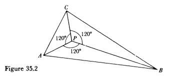
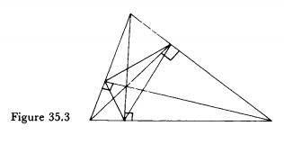
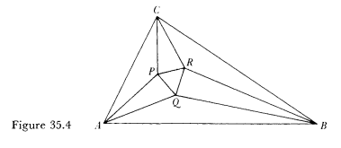
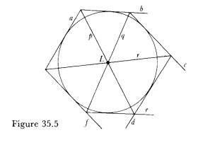
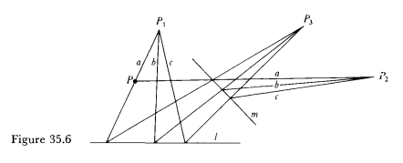
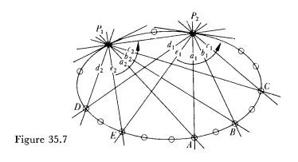
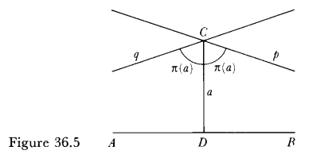

# Mathematical Thought From Ancient To Modern Times

---

## 1 Mathematics in Mesopotamia

---

## 2 Egyptian mathematics

---

## 3 The creation of classical Greek mathematics

---

## 4 Euclid and Apollonius

---

## 5 The Alexandrian Greek period : geometry and trigonometry

---

## 6 The Alexandrian period : the reemergence of arithmetic and algebra

---

## 7 The Greek rationalization of nature

---

## 8 The demise of the Greek world

---

## 9 The mathematics of the Hindus and Arabs

---

## 10 The Medieval period in Europe

---

## 11 The Renaissance

---

## 12 Mathematical contributions in the Renaissance

---

## 13 Arithmetic and algebra in the sixteenth and seventeenth centuries

---

## 14 The beginnings of projective geometry

---

## 15 Coordinate geometry

---

## 16 The mathematization of science

---

## 17 The creation of the calculus

---

## 18 Mathematics of 1700

---

## 19 Calculus in the eighteenth century

---

## 20 Infinite series

---

## 21 Ordinary differential equations in the eighteenth century

---

## 22 Partial differential equations in the eighteenth century

---

## 22 Analytic and differential geometry in the eighteenth century

---

## 24 The calculus of variations in the eighteenth century

---

## 25 Algebra in the eighteenth century

---

## 26 Mathematics of 1800

---

The Rise of Analysis.

The Motivation for the Eighteenth-Century Work.

* the mathematical work of the eighteenth was directly inspired by physical problems. The major physical field was mechanics, and particularly celestial mechanics.

The Problem of Proof.

* The very basis of the calculus not only was not clear, but had been under attack almost from the beginning of the seventeenth-century work on the subject.
* The physical meaning of the mathematics guided the mathematical steps and often supplied partial arguments to fill in nonmathematical steps. The men trusted the symbols far more than they did logic.

---

The Metaphysical Basis.

* Though the mathematicians did recognize that their creations had not been reformulated in terms of the deductive model of Euclid, they were confident of the truth of the mathematics. This confidence rested in part, as noted, on the physical correctness of the conclusions, but also on philosophical and theological grounds.

The Expansion of Mathematical Activity.

* In the eighteenth century the academies of science sponsored and supported mathematical research. The academies also supported the journals, which had become the regular outlet for new work.
* Alexander von Humboldt founded the University of Berlin and introduced the radical idea that professors should lecture on what they wished to and that students could take what they preferred.

---

A Glance Ahead.

* A vast expansion in the number of research journals.
* The mathematicians of several countries formed professional societies such as the London Mathematical Society.

---

## 27 Functions of a complex variable

---

The Beginnings of Complex Function Theory.

The Geometrical Representation of Complex Numbers.

The Foundation of Complex Function Theory.

---

## 28 Partial differential equations in the nineteenth century

---

## 29 Ordinary differential equations in the nineteenth century

---

## 30 The calculus of variations in the nineteenth century

---

## 31 Galois theory

---

## 32 Quaternions, vectors, and linear associative algebras

---

## 33 Determinants and matrices

---

## 34 The Theory of Numbers in the Nineteenth Century

---

### Gauss's Disquisitiones Arithmetic

The Theory of Congruences.

* The statement "$a$ is congruent to $b$ modulo $m$" is written mathematically as $a \equiv b \; \text{modulo} \;m$, where $m$ is called the modulus and $a$ is a residue of $b$ modulo $m$
* A congruence of the $n$th degree $Ax^n + Bx^{n-1} + \cdots + Mx + N \equiv 0 \; \text{modulo} \;m$ whose modulus is a prime number $p$ which does not divid e $A$ cannot have more than $n$ noncongruent roots.
* If $p$ is a prime and $a$ is not a multiple of $p$ then $a^{p-1} \equiv 1 \; \text{modulo} \;m$
* The classes that have the same residue modulo $i^2 + 1$ are the complex numbers.
* Reciprocity laws applicable to congruenceces of higher degrees, cubic and quadratic residues.

---

The introduction of algebraic numbers.

* Numbers of the form $f(\alpha)=a_0 + a_1 \alpha + \cdots + a_{p-2}\alpha^{p-2}$ are called complex integers, where each $a_i$ is an ordinary (rational) integer, $\alpha$ is a root of $\alpha^{p-1} + \alpha^{p-2} + \cdots + \alpha + 1 = 0$ (an imaginary $p$th root of unity).
* A number $r$ that is a root o f $a_0x^n + a_1x^{n-1} + \cdots  + a_{n-1}x + a_n = 0$, where the $a_i$'s are ordinary integers, and that is not a root of such an equation of degree less than $n$ is called an algebraic numbe $r$ of degree $n$. If the coefficient of the highest power of $x$ is 1, the solutions are called algebraic integers of degree $n$.
* For domains of the form $a+b\sqrt{-D}$ , where $D$ may have any positive integral value not divisible by a square, the unique factorization theorem is valid only when $D = 1, 2, 3, 7, 11, 19, 43, 67$, and $163$, at least for $D$'s up to $10^9$.
* The fundamental theorem in the theory of ideals is that every ideal can be factored uniquely into prime ideals (have no factors other than themself and the ideal 1).

---

The theory of forms.

* Th expression $ax^2 + 2bxy + cy^2$, wherein $a$, $b$, and $c$ are integral, is a binary form because two variables are involved, and it is a quadratic form because it is of the second degree. A number $M$ is said to be represented by the form if for specific integral value s of $a, b, c, x$, and $y$ the above expression equals $M$.
* If a number is representable by one form it is also representable by many other forms, which is called equivalent.
* Any prime number of the form $4n + 1$ can be represented as a sum of squares in one and only one way, and every number can be represented as the sum o f three triangular numbers.

---

The introduction of analytic methods.

* Every arithmetic sequence $a, a + b, \cdots, a + nb, \cdots,$ where $a$ and $b$ are relatively prime, contains an infinite number of primes.
* The function $\pi(x)$ that represents the number of primes not exceeding $x$ satisfies $\lim_{x \rightarrow \infty} \frac{\pi(x)}{x/ \log x} = 1$.
* The zeta function $\zeta(s) = \sum_{n=1}^{\infty} \frac{1}{n^s} = \prod_{n=1}^{\infty} \left(1 - \frac{1}{p_n^s}\right)^{-1}$, where $p_n$'s are prime numbers.
* The hypothesis that all the complex zeros of $\zeta(z)$ in the strip $0 < x < 1$ lie on the line $x = 1/2$ is still unproven.

---

## 35 The Revival of Projective Geometry

---

Synthetic Euclidean Geometry.

* Associated with every triangle ABC are nin e particular points , the midpoints of the sides, the feet of the three altitudes, and the midpoints of the segments which join the vertices to the point of intersection of the altitudes. All nine points lie on one circle, called the nine-point circle.
* The isoperimetric theorem: Of all plane figures with a given perimeter the circle bounds the greatest area.
* If A, B, an d C are three given points and if each of the angles of triangle ABC is less than 120°, then the point P for which PA + PB + PC is a minimum is such that each of the angles at P is 120°.

---

* Given an acute-angled triangle , consider all triangles such that each has its vertices on the three sides of the original triangle, the vertices of this triangle of minimum perimeter are the feet of the altitudes of the given triangle.

---

* If the angle trisectors are drawn at each vertex of a triangle, adjacent trisectors meet at the vertices of an equilateral triangle.

---

Synthetic Protective Geometry.

* if there are six tangents to a conic, thus forming a circumscribed hexagon, the three lines, each of which joins two opposite vertices, pass through one point (the dual theorem of Pascal's theorem).

---

* Two figures are homologous if one can be derived from the other by one projection and a section, which is called a perspectivity, or by a sequence of projections and sections, that is, a projectivity.
* If one figure is derived from another by a continuous change and the latter is as general as the former, then any property of the first figure can be asserted at once for the second figure.
* The notion of pole and polar with respect to a conic.
* The term "duality" to denote the relationship between the original and new theorem.

---

* The tangent lines of a point curve are a line curve and in the case of a conic do constitute the dual curve. Conversely every line conic envelopes a point conic or is the collection of tangents of a point conic.

---

* One starts with two pencils of lines, say $p_1$ and $p_3$ that are perspectively related through a pencil of points on a line $l$, and the pencils $p_3$ and $p_2$ that are perspectively related by means of a pencil of points on another line $m$. Then the pencils $p_1$ and $p_2$ are said to be projectively related. The lines marked $a$ in the pencil with center at $P_1$ and the pencil with center at $P_2$ are examples of corresponding lines of the projectivity between the two pencils $p_1$ and $p_2$. A conic is now defined as the set of points of intersection of all pairs of corresponding lines of the two projective pencils.

---

* If the coordinates of these points are $x_1, x_2, x_3$, and $x_4$, then the cross ratio is defined to be $\frac{x_1 - x_3}{x_1 - x_4} / \frac{x_2 - x_3}{x_2 - x_4}$. A harmonic set of four points is one for which the cross ratio is $-1$.

---

Algebraic Projective Geometry.

* If $f(x_1, x_2, x_3) = 0$ is the equation of a conic with $(x_1, x_2, x_3)$ as the coordinates of a point on the conic then $\frac{\partial f}{\partial x_1} x_1' + \frac{\partial f}{\partial x_2} x_2' + \frac{\partial f}{\partial x_3} x_3' = 0$ can be interpreted, when $x_1', x_2', x_3'$ are the running coordinates, as the equation of the tangent at the point $(x_1, x_2, x_3)$ or, when $x_1, x_2, x_3$ are the running coordinates, as the equation of the polar line of the arbitrary point $(x_1', x_2', x_3')$ with respect to the conic.
* In the homogeneous coordinate system $x_1, x_2, x_3$ the equation of the infinitely distant line is $x_3 = 0$.

---

Higher Plane Curves and Surfaces.

* Condider the intersections of an $m$th degree curve $C_m$ and an $n$th degree curve $C_n$, where $C_m = C_m' + A_{m-n}C_n = 0$ for the case where $m > n$ so that $A_{m-n}$ is a polynomial of degree $m-n$. Given $mn - (n-1)(n-2)/2$ arbitrary points on $C_n$, the remaining $(n-1)(n-2)/2$ of the $mn$ intersection points with a $C_m$ are determined.
* Plücker formulas.

---

## 36 NonEuclidean Geometry

---

The Status of Euclidean Geometry.

* Our minds supply certain modes of organization of space and time and that experience is absorbed and organized by our minds in accordance with these modes. The nature of the external world is known to us only in the manner in which our minds oblige us to interpret it. The physical world must be Euclidean.

The Research on the Parallel Axiom.

* One was to replace the parallel axiom by a more self-evident statement. The other was to try to deduce it from the other nine axioms of Euclid.

---

Foreshadowings of Non-Euclidean Geometry.

* The area of a polygon of n sides is proportional to the difference between the sum of the angles and $2n — 4$ right angles.
* The geometry on a real sphere has the properties of the geometry based on the obtuse angle hypothesis and the geometry on a sphere of imaginary radius has the properties of the geometry based on the acute angle hypothesis.

---

The Technical Content of Non-Euclidean Geometry.

* if C is a point at a perpendicular distance a from the line AB, then there exists an angle $\pi(a)$ such that all lines through C which make with the perpendicular CD an angle less than $\pi(a)$ will intersect AB; all other lines through C do not intersect AB. If $\pi(a) = \pi / 2$ then the Euclidean axiom results. If not, then it follows that $\pi(a)$ increases and approaches $\pi / 2$ as $a$ decreases to zero, and $\pi(a)$ decreases and approaches zero as $a$ becomes infinite.

$$
\tan \frac{\pi(x)}{2} = e^{-x/k}
$$

---

* The trigonometric formulae for a right angled triangle ABC, with sides of hyperbolic lengths a, b, c opposite angles $\alpha$ $\beta$, $\pi/2$ at vertices A, B, C respectively are: $
\cos \beta = \tanh a / \tanh c, \sin \beta = \sinh b / \sinh c, \tan \beta = \tanh b / \sinh a$. The sine law is $\frac{\sinh a}{\sin \alpha} = \frac{\sinh b}{\sin \beta} = \frac{\sinh c}{\sin \gamma}$.
* In the non-Euclidean geometry the area of a triangle with angles $A$, $B$, and $C$ is $r^2 [\pi - (A + B + C)]$. The entire circumference of a circle of radius $r$ is $\pi (e^r - r^{-r})$.

---

## 37 The Differential Geometry of Gauss and Riemann

---

Gauss's Differential Geometry.

* The fundamental quantity on any surface is the element of arc length which in $(x, y, z)$ coordinates is $ds^2 = E(u,v)du^2 + 2F(u,v)du \, dv + G(u,v)dv^2$, where $E=x_u^2 + y_u^2 + z_u^2$, $F=x_ux_v + y_uy_v + z_uz_v$, $G=x_v'^2 + y_v'^2 + z_v'^2$.
* The angle between two curves on a surface is another fundamental quantity. If two curves emanate from $(u, v)$, one given by $du : dv$ and the other by $du' : dv'$, and if $\theta$ is the angle between these curves, then

$$
\cos \theta = \frac{Edudu' + F(dudv' + du'dv) + Gdvdv'}{\sqrt{Edu^2 + 2Fdu\,dv + Gdv^2}\sqrt{Edu'^2 + 2Fdu'\,dv' + Gdv'^2}}.
$$

---

* Consider a unit sphere and choose a radius having the direction of the directed normal at $(x, y, z)$. The choice of radius determines a point $(X, Y, Z)$ on the sphere. The curvature is defined as the limit of the ratio of the area of the region on the sphere to the area of the corresponding region on the surface. The (total) curvature is

$$
K = \frac{LN - M^2}{EG - F^2},
$$

where in

$$
L = \left|\begin{array}{ccc}x_{uu}&y_{uu}&z_{uu}\\x_{u}&y_{u}&z_{u}\\x_{v}&y_{v}&z_{v}\end{array}\right|,
M = \left|\begin{array}{ccc}x_{uv}&y_{uv}&z_{uv}\\x_{u}&y_{u}&z_{u}\\x_{v}&y_{v}&z_{v}\end{array}\right|,
N = \left|\begin{array}{ccc}x_{vv}&y_{vv}&z_{vv}\\x_{u}&y_{u}&z_{u}\\x_{v}&y_{v}&z_{v}\end{array}\right|.
$$

---

* To move a part of a surface over to another part (which means preserving distance) a necessary condition is that the surface have constant curvature.If two surfaces do have constant and equal curvature then one can be mapped isometrically onto the other.
* If there is but one geodesic arc between two points in a region, that arc gives the shortest path between them in that region.
* Let $K$ be the variable curvature of a surface. $\int \int _A K \, dA$ is then the integral of this curvature over the area A, which means the area of a spherical triangle equals the product of its spherical excess and the square of the radius, for in a spherical triangle $K$ is constant and equals $1 /R^2$.
* The same surface can have different geometries depending on the choice of the functions $E$, $F$, and $G$.

---

Riemann's Approach to Geometry.

* Riemann believed that we know space only locally he started by defining the distance between two generic points whose corresponding coordinates differ only by infinitesimal amounts.

$$
ds^2 = \sum_{i=1}^n \sum_{j=1}^n g_{ij} dx_i dx_j,
$$

wherein the $g_{ij}$ are functions of the coordinates $x_1, x_2, , \cdots, x_n$, $g_{ij} = g_{ji}$, and the right side of the above equation is always positive for all possible values of the $dx_i$.

---

* The angle $\theta$ between two curves meeting at a point $(x_1, x_2, \cdots , x_n)$, one curve determined by the directions $dx_i / ds$, $i = 1, 2, \ldots, n$, and the other by $dx_i' / ds'$, $i = 1, 2, ... , n$, where the primes indicate values belonging to the second direction, is defined by the formula

$$
\cos \theta = \sum_{i,i'=1}^n g_{ii'} \frac{dx_i}{ds} \frac{dx_i'}{ds}.
$$

---

* In terms of the parameter arc length $s$, the equations of the geodesics prove to be

$$
\frac{d^2x_i}{ds^2}+\sum_{\lambda, \mu} \Gamma^{\lambda \mu}_{i} \frac{dx_{\lambda}}{ds}\frac{dx_{\mu}}{ds} = 0, \quad i, \lambda, \mu = 1, 2, \cdots, n,
$$

wherein $\Gamma^{\alpha \beta}_{\lambda} = \sum_i g^{i \lambda} \Gamma_{\alpha \beta, i}$.

---

* For a manifold which is a surface, Riemann's curvature is exactly Gauss's total curvature.

$$
K = -\frac{\left[\Omega\right]}{8 \Delta^2},
$$

where

$$
\left[\Omega\right] = \sum_{i,k,r,s}(ik,rs)p_{ik}p_{rs},
$$

$$
4 \Delta^2 = \sum g_{ij} dx_i dx_j \cdot \sum g_{ij} \delta x_i \delta x_j - \left(\sum g_{ij} dx_i \delta x_j \right)^2,
$$

$$
(\mu\lambda, jk)=\frac{\partial \Gamma_{\lambda j, \mu}}{\partial x_k} - \frac{\partial \Gamma_{\lambda k, \mu}}{\partial x_j} + \sum_{i,\alpha} g^{i\alpha} \left(\Gamma_{\lambda k, \alpha}\Gamma_{\mu j, i} - \Gamma_{\lambda j, \alpha}\Gamma_{\mu k, i}\right),
$$

$$
\Gamma_{\alpha \beta, i} = \frac{1}{2} \left( \frac{\partial g_{\alpha \lambda}}{\partial x_{\beta}} + \frac{\partial g_{\beta \lambda}}{\partial x_{\alpha}} - \frac{\partial g_{\alpha \beta}}{\partial x_{\lambda}}\right).
$$

---

* The $n(n + I) /2$ partial differential equations that are the necessary and sufficient conditions that a transformation $x_i(y_1, y_2, \cdots, y_n)$ exists for which $F = F'$ are

$$
\sum_{r,s} g_{rs} \frac{\partial x_r}{\partial y_\alpha} \frac{\partial x_s}{\partial y_\beta} = g'_{\alpha \beta}.
$$

---

Invariants of Differential Forms.

* For rectangular Cartesian coordinates, the differential invariants are

$$
\Delta_1 \phi = \left(\frac{\partial \phi}{\partial x}\right)^2 + \left(\frac{\partial \phi}{\partial y}\right)^2 + \left(\frac{\partial \phi}{\partial z}\right)^2,
$$

$$
\Delta_2 \phi = \frac{\partial^2 \phi}{\partial x^2} + \frac{\partial^2 \phi}{\partial y^2} + \frac{\partial^2 \phi}{\partial z^2}.
$$

---

* Two differential invariants of surfaces are

$$
\Delta_1 \phi = \frac{1}{EG- F^2} \left\{ E \left(\frac{\partial \phi}{\partial v}\right)^2 - 2F \frac{\partial \phi}{\partial u} \frac{\partial \phi}{\partial v} + G \left(\frac{\partial \phi}{\partial v}\right)^2 \right\},
$$

$$
\Delta_2 \phi = \frac{1}{\sqrt{EG- F^2}} \left\{ \frac{\partial}{\partial u} \left(\frac{G \phi_u - F \phi_v}{\sqrt{EG- F^2}}\right) + \frac{\partial}{\partial v} \left(\frac{-F \phi_u + E \phi_v}{\sqrt{EG- F^2}}\right)\right\}.
$$

---

* Let $g$ be the determinant of the $g_{ij}$ and let $g^{ij}$ be the cofactor divided by $g$ of $g_{ij}$ in $g$. For quadratic differential forms in $n$-dimensional Riemannian spaces, the invariants are

$$
\Delta_1(\phi) = \sum_{i,j} g^{ij} \frac{\partial \phi}{\partial x_i} \frac{\partial \phi}{\partial x_j},
$$

$$
\Delta_2(\phi) = \frac{1}{\sqrt{g}} \sum_{i} \frac{\partial}{\partial x_i} \left( \sqrt{g} \sum_j g^{ij} \frac{\partial \phi}{\partial x_j} \right).
$$

---

## 38 Projective and Metric Geometry

---

Surfaces as Models of Non-Euclidean Geometry.

Projective and Metric Geometry.

Models and the Consistency Problem.

The Reality qf Non-Euclidean Geometry.

---

## 39 Algebraic Geometry

---

## 40 The Instillation of Rigor in Analysis

---

## 41 The Foundations of the Real and Transfinite Numbers

---

## 42 The Foundations of Geometry

---

## 43 Mathematics as of 1900

---

## 44 The Theory of Functions of Real Variables

---

## 45 Integral Equations

---

## 46 Functional Analysis

---

## 47 Divergent Series

---

## 48 Tensor Analysis and Differential Geometry

---

## 49 The Emergence of Abstract Algebra

---

## 50 The Beginnings of Topology

---

## 51 The Foundations of Mathematics

---
